 
## 查看主页获取源码

> **作者介绍**： **✌**全网粉丝10W+本平台特邀作者、博客专家、CSDN新星计划导师、java领域优质创作者,博客之星、掘金/华为云/阿里云/InfoQ等平台优质作者、专注于项目实战 **✌**

  

### 一、作品包含

源码+数据库+设计文档万字+PPT+全套环境和工具资源+部署教程

### 二、项目技术

前端技术：Html、Css、Js、Vue、Element-ui

数据库：MySQL

后端技术：Java、Spring Boot、MyBatis

  

### 三、运行环境

开发工具：IDEA/eclipse

数据库：MySQL5.7

数据库管理工具：Navicat10以上版本

环境配置软件： JDK1.8+Maven3.6.3

前端Nodejs：14

### 四、项目介绍
项目编号：springbootA109

旅游民宿信息管理系统是在旅游业与共享经济迅速发展的背景下产生的，旨在为游客提供便捷，以促进旅游民宿行业的规范化和信息化发展。

前台用户功能：浏览首页、民宿信息、旅游景点、旅游路线、公告信息、后台管理、个人中心。

后台分为管理员和用户
管理员的功能：系统首页、个人中心、用户管理、民宿信息管理、旅游景点管理、旅游路线管理、订房订单管理、评价记录管理、系统管理。
用户的功能：系统首页、个人中心、订房订单管理、评价记录管理。

### 五、运行截图

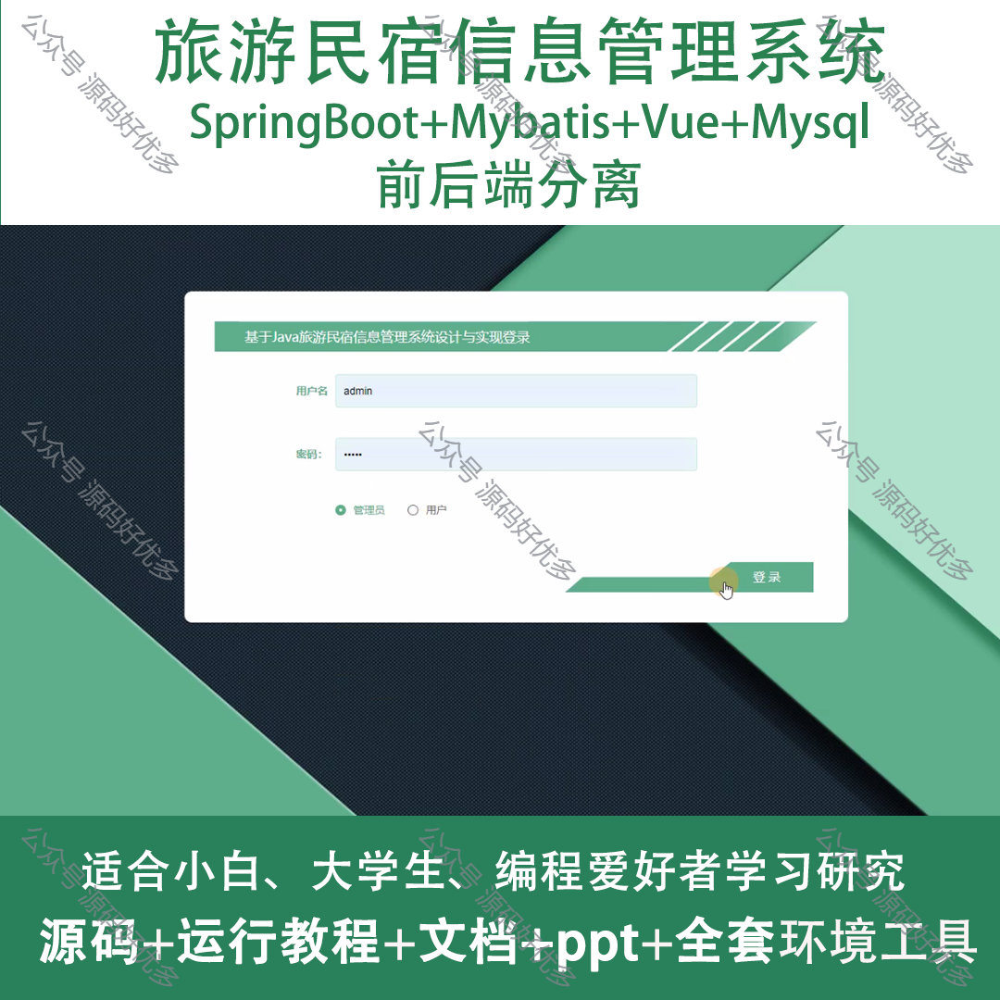
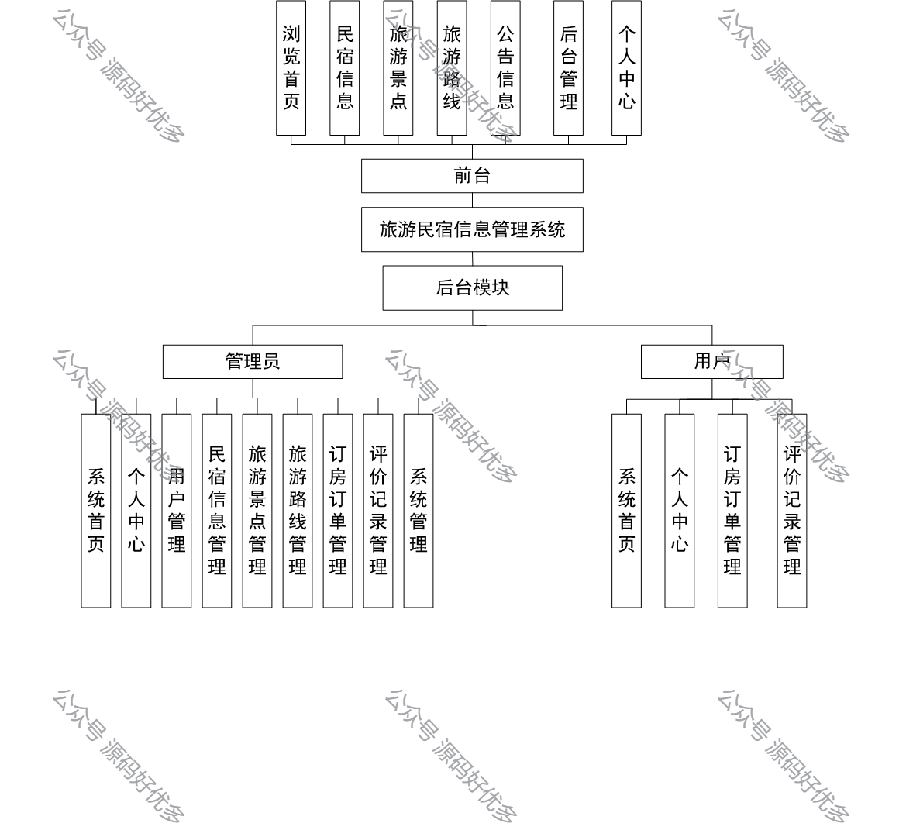
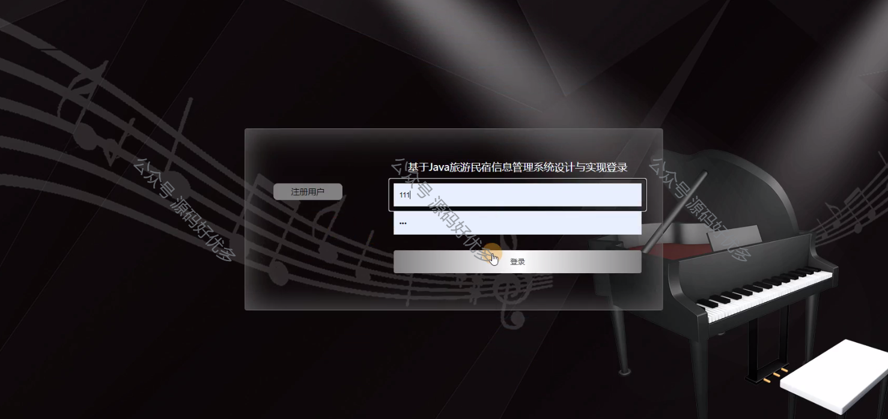
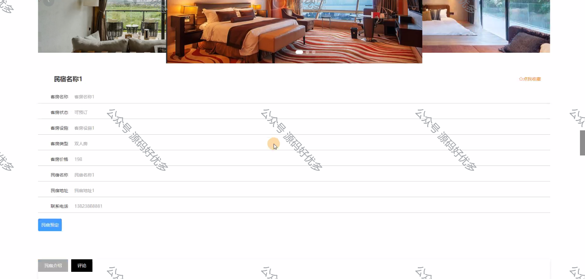
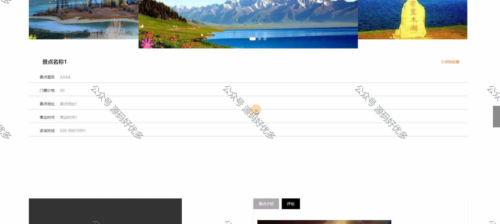
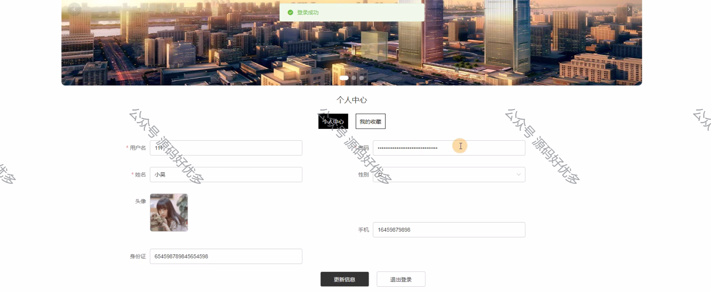
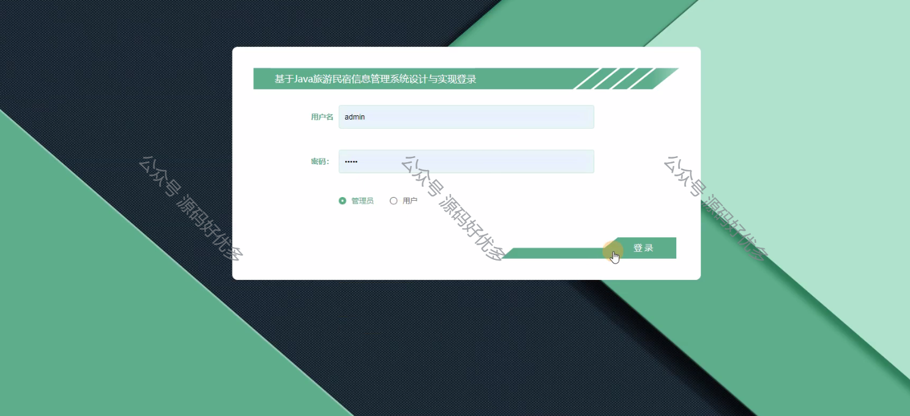
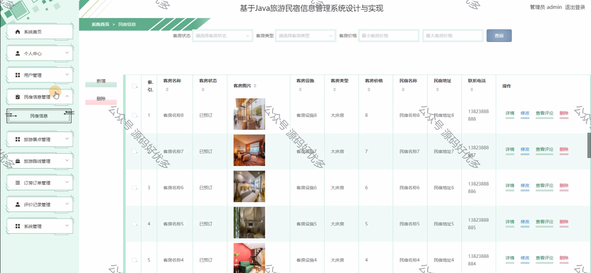
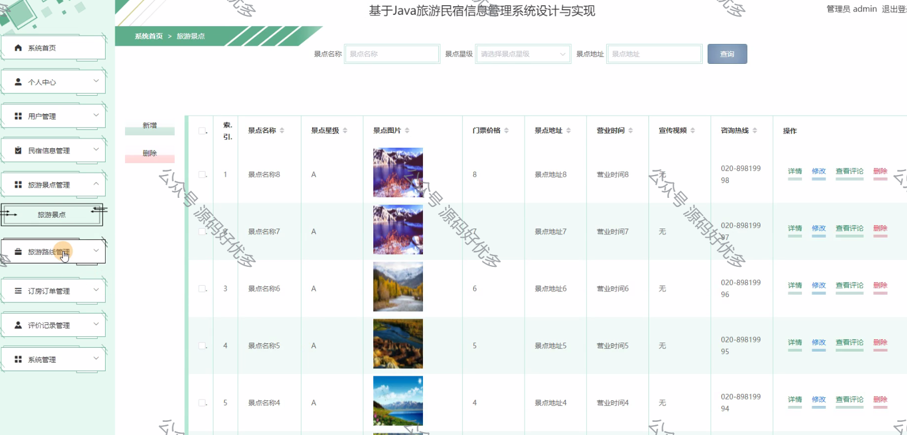
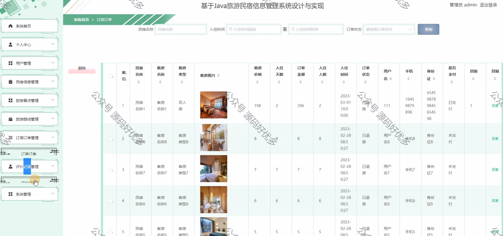
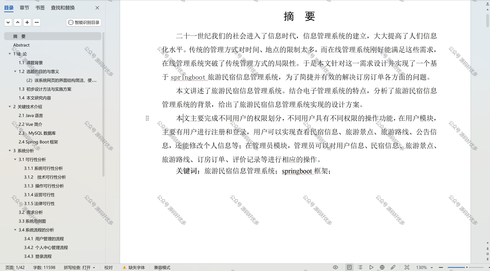

  
